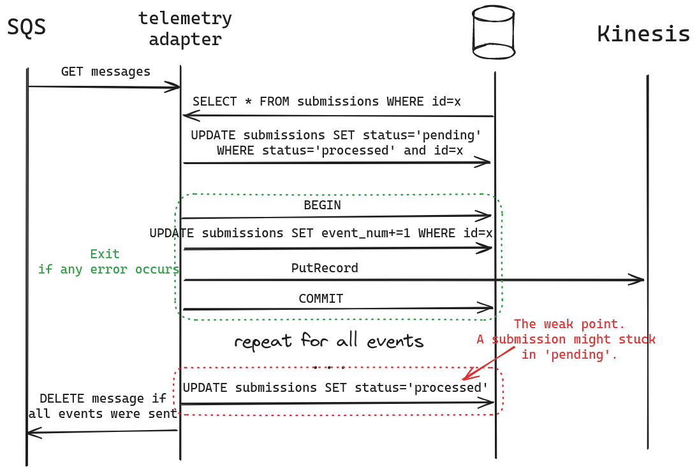

# Telemetry Adapter
This is a service that receives telemetry messages from [an SQS queue](https://docs.aws.amazon.com/sqs/), 
converts messages into events, and sends the events to [a Kinesis stream](https://docs.aws.amazon.com/kinesis/).

## Motivation
When processing device telemetry submissions, we encounter several risks:
1. Invalid and/or malicious submissions;
2. Low performance and difficulties with delivering data to multiple consumers 
(a fan-out delivery).
3. Submission duplicates (a standard SQS queue guarantees at least one delivery, 
so multiple consumers might receive the same submission).

Using this service with a Kinesis stream helps mitigate these risks.

## Project Goals
1. Receive device submissions.
2. Parse and validate submissions.
3. Convert submissions into a set of events.
4. Route events to a Kinesis stream.
5. Clear an SQS queue from delivered and invalid messages. 
6. Ensure an event order.
7. Ensure the absence of duplicate events.
8. Ensure no data loss.

## Design
The application consists of two parts: an HTTP server and a worker processing
SQS messages. 

Currently, an HTTP server provides only a healthcheck endpoint
based on a worker status.

The worker polls an SQS queue, parses, and validates messages. Afterwards,
the worker asynchronously processes all received messages. The worker stores the state
of every submission in a PostgreSQL database so that a Kinesis and/or network
outage will have a minimal impact on an event order and an event number (see image). 
Additionally, the state storage helps avoid duplicates in case two workers receive 
the same submission simultaneously.



## Getting Started
1. Install [Docker](https://docs.docker.com/get-docker/).
2. Configure an SQS queue and a Kinesis stream.
3. Set your configurations in a file [.env](.env). 
Alternatively, you can set parameters when you start a container.
4. Build a Docker image.
   ```shell
   docker build . --tag telemetry-adapter
   ```
5. Run the service container.
   ```shell
   docker run telemetry-adapter
   ```
   If everything works fine, you can see application log notes and 
   consume messages from a Kinesis stream.

## Development
### Run in a Testing Environment
Follow these steps to run a testing environment.
1. Install [Docker](https://docs.docker.com/get-docker/).
2. Go to the upper directory and execute this command:
    ```shell
    docker compose up --build
    ```
   This command will run device emulators (`sensor-fleet`), an SQS queue,
   a Kinesis stream (`localstack`), and this service.
3. When you update a service code, the application will immediately restart with
the updated code.

### Tests
TODO: There are no tests in the project yet.